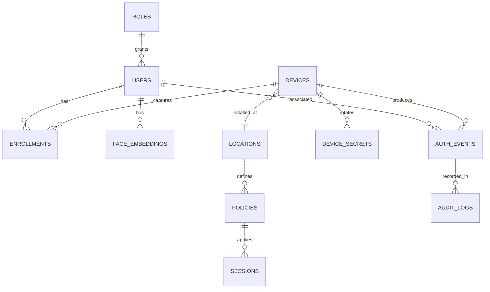
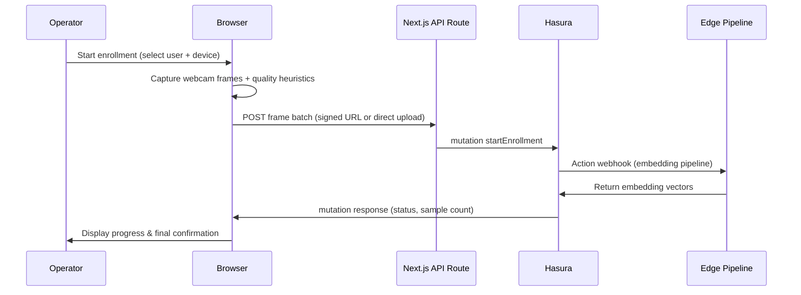

# Solution Architecture

## 1. Overview

This document describes the end-to-end architecture for a biometric access control platform composed of:

- A **Next.js 14** web application for administrators, operators, and auditors.
- A **Hasura GraphQL + Postgres** backend acting as the system of record and API surface.
- An **edge agent** running on Raspberry Pi hardware that performs face detection, embedding, and matching.
- Optional **LPWAN** (LoRaWAN/NB-IoT) integration for resilient event delivery.

The platform emphasises security, privacy, and resilience while enabling real-time enrollment, monitoring, and reporting across connected devices.

```
+--------------+      HTTPS GraphQL      +----------------------+      TLS MQTT/Webhooks     +------------------+
|  Frontend    | <---------------------> |  Hasura GraphQL API  | <------------------------> | LPWAN Integrator |
| (Next.js)    |       + WebSockets      |  + Postgres          |                           | (ChirpStack etc) |
+--------------+                          +----------+-----------+                           +------------------+
                                                     ^
                                                     |
                                                     | HTTPS GraphQL (primary)
                                                     v
                                             +-------------------+
                                             | Raspberry Pi Edge |
                                             |  (Python agent)   |
                                             +-------------------+
```

Stakeholder roles:

- **Admin** — full control over policies, devices, users, and audit data.
- **Operator** — manage enrollments, monitor events, rotate device secrets.
- **Auditor** — read-only access to events, logs, and reports.
- **Device** — constrained role used by edge agents for GraphQL access.

---

## 2. Monorepo Layout

The project is delivered as a polyglot monorepo to keep application, backend metadata, and edge agent synchronized.

```
.
├── frontend/                  # Next.js app (TypeScript, App Router)
│   ├── app/                   # Route tree
│   ├── components/            # Reusable UI (shadcn/ui)
│   ├── lib/                   # GraphQL client, utilities
│   ├── graphql/               # GraphQL documents & codegen outputs
│   ├── features/              # Domain slices (enrollment, devices, events, policies)
│   └── tests/                 # Playwright & unit tests
├── hasura/
│   ├── metadata/              # Hasura metadata (tables, relationships, permissions)
│   ├── migrations/            # SQL migrations
│   ├── seeds/                 # Seed data (demo users, devices)
│   └── actions/               # Action/Remote schema handlers (Node/Python)
├── edge-pi/
│   ├── src/
│   │   ├── camera.py
│   │   ├── detect.py
│   │   ├── embed.py
│   │   ├── match.py
│   │   ├── cache.py
│   │   ├── comms.py
│   │   ├── storage.py
│   │   └── main.py
│   ├── config/
│   ├── models/
│   ├── scripts/               # Deployment helpers, systemd units
│   └── tests/                 # pytest suite
└── docs/                      # Architecture, runbooks, ADRs
```

Package management:

- **Frontend** — managed with `pnpm` workspaces; linting via ESLint + Prettier; testing via Vitest + Playwright.
- **Hasura** — Hasura CLI + metadata versioning; migrations orchestrated via CI/CD.
- **Edge** — Python 3.11 virtualenv with `poetry` or `pip-tools`; cross-compilation for Pi wheels handled via Docker buildx.

---

## 3. Data Model

### 3.1 Entity Relationship Overview



### 3.2 Table Definitions (Excerpt)

A canonical SQL representation is provided in `docs/schema.sql`. Key highlights:

- **users** — Managed identities with role references and status fields (active, suspended, pending).
- **face_embeddings** — Stores the embedding vectors (FLOAT[512] or vector type). Embeddings reference `model_version` and creation timestamps.
- **devices** — Physical readers bound to a `location_id` and status (active, maintenance, decommissioned).
- **device_secrets** — Rotating secrets hashed with bcrypt/argon2; optional `expires_at` for rotation policies.
- **enrollments** — Ties users to devices for sample collection, tracks sample counts and approvals.
- **auth_events** — Records edge authentication attempts, including optional similarity score and payload for audit.
- **locations** — Hierarchical or simple mapping of physical spaces; `metadata` JSONB for extra context.
- **policies** — Define access rules per location, allowed roles, and time schedules (e.g., using cron/JSON schedule).
- **audit_logs** — Immutable ledger of operations across UI/API with actor context.
- **sessions** — (Optional) track login sessions for token revocation and auditing.

Row-level security is enforced via Hasura permissions using `x-hasura-role` and `x-hasura-device-id`. Device-scoped queries filter by matching device or location assignments.

---

## 4. Frontend Architecture

### 4.1 Technology Choices

- **Next.js 14 App Router** — for server components, streaming, and edge readiness.
- **TypeScript** — strong typing with path aliases (`@/components`, `@/lib`, etc.).
- **shadcn/ui + Tailwind CSS** — consistent design system with Radix primitives.
- **Auth.js (NextAuth)** — JWT session strategy backed by Hasura as identity provider (via webhook or custom service).
- **urql** — lightweight GraphQL client with SSR support. Code generation via `@graphql-codegen/cli` producing typed hooks.
- **State management** — minimal; rely on React Query cache via `urql` or integrate Zustand for local cross-component state.

### 4.2 Route Plan

```
/app
├── (auth)/login              # Auth UI, device selection
├── dashboard                 # Overview cards, system health
├── users/
│   ├── page.tsx              # List view with filters
│   ├── [userId]/page.tsx     # Detail profile, audit logs
│   └── [userId]/enroll/
│       └── page.tsx          # Webcam enrollment workflow
├── devices/
│   ├── page.tsx              # List & status
│   ├── provision/page.tsx    # Device onboarding wizard
│   └── [deviceId]/rotate     # Secret rotation modal/page
├── events/
│   ├── page.tsx              # Live feed via GraphQL subscription
│   └── reports/page.tsx      # Historical analytics (SSR)
├── policies/
│   ├── page.tsx              # Policy listing
│   └── [policyId]/page.tsx   # CRUD views
└── settings/
    ├── page.tsx              # General settings
    ├── models/page.tsx       # Model version management
    ├── retention/page.tsx    # Data retention policy
    └── lpwan/page.tsx        # LPWAN configuration
```

Sharded layout segments support role-based gating and reduce bundle sizes. Shared layout components provide breadcrumbs, role switchers, and context providers.

### 4.3 Enrollment Flow



### 4.4 Auth & Authorization

- Device, operator, admin, and auditor roles encoded in JWTs issued by Hasura auth webhook.
- Next.js uses middleware to protect routes based on role claims.
- GraphQL documents annotated with `@cached` or `@live` directives for urql caching and subscription behaviour.

### 4.5 UI & UX Considerations

- Accessibility-first (ARIA attributes, keyboard navigation).
- Dark/light themes with Tailwind tokens.
- Real-time toast notifications for device events (WebSocket subscription to Hasura).
- Offline indicator for operations relying on the edge pipeline.

---

## 5. Backend (Hasura + Postgres)

### 5.1 Hasura Metadata

- **Tables & Relationships** — defined via migrations. Uses foreign keys and cascade rules for referential integrity.
- **Computed fields** — e.g., `users.last_enrollment_at`, `devices.last_seen_at`.
- **Views** — aggregated event stats for dashboards.
- **Enums** — `user_status`, `device_status`, `decision` (ALLOW, DENY, REVIEW), `mode` (FACE_ONLY, MFA, OVERRIDE).
- **Remote Schemas/Actions** — integrates with services for embedding, provisioning, signed URLs.

Directory structure under `hasura/` aligns with Hasura CLI conventions:

```
hasura/
├── config.yaml
├── metadata/
│   ├── databases/databases.yaml
│   ├── actions.yaml
│   ├── sources/{default}/tables/
│   └── remote_schemas.yaml
├── migrations/default/
└── seeds/default/
```

### 5.2 Row-Level Security (RLS)

Hasura permissions per role:

- **admin** — full select/insert/update/delete.
- **operator** — limited to permitted locations/devices; cannot view hashed secrets or embeddings directly (only aggregated info).
- **auditor** — read-only on users, devices, events, audit logs.
- **device** — restricted to `auth_events` insert, limited `devices` select (only self record), `face_embeddings` subscription for assigned location.

Policies use session variables `x-hasura-role`, `x-hasura-user-id`, `x-hasura-device-id`, and `x-hasura-location-ids` (array).

### 5.3 Actions & Event Triggers

- `start_enrollment(user_id, device_id)` — kicks off embedding pipeline via remote handler (Node/Python service) that processes uploaded images.
- `provision_device(name, location_id)` — generates device secret, registers in Hasura, returns provisioning bundle/QR.
- `generate_signed_url(object_path, purpose)` — integrates with storage provider (S3, GCS, or MinIO).
- Event trigger on `auth_events` inserts — posts notifications to ops channels (Slack/Teams), updates aggregated stats table, and optionally triggers LPWAN webhook for integrators.

### 5.4 Integrations

- **Storage** — optional image retention. Use S3-compatible bucket with lifecycle policies (default delete after 30 days).
- **Notification** — Webhook to alerting service (PagerDuty, Opsgenie) on suspicious events or high similarity anomalies.
- **Observability** — Hasura metrics scraped by Prometheus/Grafana. Postgres logs shipped to centralized logging.

---

## 6. Edge (Raspberry Pi) Architecture

### 6.1 Hardware & OS

- Raspberry Pi 5 (or 4 with adequate performance)
- IMX708-based camera module (Camera Module 3) with autofocus.
- Ubuntu Server 23.10 or Raspberry Pi OS Bookworm (64-bit).
- GPU acceleration enabled (FKMS/Wayland) for camera pipeline if available.

### 6.2 Software Stack

- Python 3.11 runtime with `poetry` for dependency management.
- `opencv-python` or `opencv-python-headless` compiled for Pi.
- `tflite-runtime` wheels for Arm64.
- `numpy`, `scipy`, `onnx`, `ultralytics` (for export pipeline), `requests`, `tenacity` (retry/backoff), `aiohttp` or `httpx`.
- Local data stored via `sqlite` or `tinydb` for caching, plus `lmdb` for embedding store.

### 6.3 Module Responsibilities

- `camera.py` — Captures frames, applies heuristics (exposure, blur, occlusion) to filter poor samples.
- `detect.py` — Loads YOLOv8n-face TFLite model, outputs bounding boxes with confidence thresholds.
- `embed.py` — Crops faces, normalizes, runs MobileFaceNet/ArcFace TFLite to produce embeddings.
- `match.py` — Computes cosine similarity, applies thresholds (configurable per model version), and multi-sample consensus.
- `cache.py` — Synchronises relevant embeddings using Hasura GraphQL queries filtered by device location and policy; uses incremental sync via timestamps.
- `comms.py` — Handles HTTPS GraphQL mutations/subscriptions with device JWT; implements offline queue with exponential backoff; formats LPWAN payloads for fallback.
- `storage.py` — Abstracts local key-value stores for queue, config, and caches.
- `main.py` — Orchestrates event loop, integrates liveness/anti-spoof hooks, coordinates detection → embedding → matching → reporting.

### 6.4 Resilience & Security

- **Offline Queue** — Local queue persists events while offline (sqlite/LMDB) with exponential backoff and jitter.
- **Clock Sync** — `chrony` configured to maintain accurate timestamps (critical for event ordering and JWT validation).
- **Device Secrets** — Provisioned via secure channel (QR/USB). Secrets stored hashed; JWT obtained via Hasura auth webhook.
- **Firmware Updates** — Deploy via container image (balena, Docker) or systemd service with OTA tooling. Signed images ensure integrity.

### 6.5 LPWAN Fallback

- Payload schema: `{ event_id, device_id, timestamp, decision, similarity?, user_hint? }` compressed/encoded as CBOR or protobuf depending on integrator.
- Uplink via chosen LPWAN network server (e.g., ChirpStack). Downlink commands can trigger remote secret rotations or config changes.

---

## 7. Security & Privacy

1. **Data Minimisation** — Store embeddings (vectors) by default; image retention optional and configurable with auto-expiry policies.
2. **Transport Security** — Strict TLS, mutual auth optionally for device communications. Use device-scoped JWTs with short lifetimes and refresh flows.
3. **Secrets Management** — Device secrets rotated periodically; operator/admin credentials integrated with SSO (OIDC/SAML) if required.
4. **Auditability** — All admin/operator actions logged in `audit_logs`. Tamper-evident via cryptographic hashing or append-only storage (e.g., AWS QLDB integration for higher assurance).
5. **Access Control** — RLS policies enforce separation between tenants/locations. Operators only access assigned locations.
6. **Privacy Controls** — Configurable retention for embeddings, events, and logs. Support subject access requests (export user data, delete upon request).
7. **Compliance** — Ensure GDPR readiness (lawful basis, DPIA), maintain consent records for enrollments.

---

## 8. Observability & Operations

- **Metrics** — Hasura exposes Prometheus metrics; edge agent emits metrics via StatsD/Telegraf (events per device, false accept/reject counters, pipeline latency).
- **Logging** — Structured JSON logs shipped via Fluent Bit to centralized storage (e.g., Elasticsearch, Loki).
- **Tracing** — Optional OpenTelemetry instrumentation for Next.js API routes and edge webhook handlers.
- **Alerting** — Threshold-based alerts on auth failure rates, device offline durations, queue backlogs.
- **Runbooks** — Documented procedures for device provisioning, enrollment troubleshooting, secret rotation, and incident response.

---

## 9. Deployment Strategy

| Component | Hosting | CI/CD |
|-----------|---------|-------|
| Frontend (Next.js) | Vercel (preferred) or containerized on Kubernetes | GitHub Actions deploying via Vercel CLI; lint/test gates |
| Hasura + Postgres | Hasura Cloud + managed Postgres (Neon/AWS RDS). Alternative: Kubernetes with StatefulSet Postgres. | GitHub Actions applying migrations & metadata using Hasura CLI |
| Actions/Remote services | Serverless functions (Vercel, AWS Lambda) or container microservices | Included in Hasura CI/CD pipeline |
| Edge Agent | Deployed to Pi via balenaCloud, Ansible, or custom OTA | Edge build pipeline producing signed images; tests executed via pytest on cross-compiled env |

IaC (Terraform/Pulumi) recommended to manage cloud resources. Secrets stored in Vault/SOPS.

---

## 10. Milestones & Task Breakdown

1. **Infrastructure Foundation**
   - Provision Hasura Cloud project and managed Postgres.
   - Configure domain, TLS, and networking.
   - Bootstrap Hasura metadata (tables, relationships).

2. **Backend Enhancements**
   - Implement RLS policies and role mappings.
   - Create Hasura actions for enrollment & provisioning.
   - Set up event triggers and notification integrations.

3. **Frontend MVP**
   - Scaffold Next.js app with shadcn/ui, Tailwind, Auth.js.
   - Implement login, dashboard, users listing, and enrollment flow (with webcam capture).
   - Integrate GraphQL codegen and subscriptions for live events.

4. **Edge Agent Prototype**
   - Prepare Pi image, install dependencies, validate camera stream.
   - Integrate detection (YOLOv8n-face TFLite) and embedding (MobileFaceNet).
   - Implement local cache, matching, and GraphQL reporting.

5. **LPWAN Integration**
   - Select provider (e.g., ChirpStack + LoRaWAN gateway).
   - Define compact payload schema and backend webhook handler.
   - Test failover scenarios and message reconciliation.

6. **Security & Observability**
   - Enforce device secret rotation workflow.
   - Implement audit logging UI and backend.
   - Configure metrics dashboards and alerting policies.

7. **Performance & Tuning**
   - Benchmark edge pipeline (latency < 200 ms per frame, 10–20 FPS target).
   - Tune similarity thresholds per model version.
   - Load test Hasura (GraphQL queries, live subscriptions).

8. **Launch Readiness**
   - Conduct privacy impact assessment and security review.
   - Finalize documentation, runbooks, and support procedures.
   - Establish DR/BCP strategy (backups, multi-region replicates if required).

---

## 11. Open Decisions

| Topic | Options | Recommendation / Next Steps |
|-------|---------|------------------------------|
| **Monorepo Tooling** | Turborepo vs. Nx vs. pnpm workspaces | Start with pnpm workspaces + Turbo for builds; revisit if complexity grows |
| **Auth Provider** | Auth.js with Hasura webhook, external IdP (Auth0, Clerk), Hasura JWT only | Use Auth.js for frontend sessions, Hasura webhook to issue JWTs aligned with RBAC |
| **Storage for Images** | Skip image storage, S3 w/ retention, Self-hosted MinIO | Default to embeddings-only; enable S3 with 30-day TTL for audit use cases |
| **LPWAN** | LoRaWAN (ChirpStack), NB-IoT (carrier), LTE-M | Pilot with LoRaWAN (ChirpStack) due to available ecosystem |
| **Edge Packaging** | Docker containers, balenaOS, Snap packages | Containerized deployment via Docker + systemd, with Balena as managed option |
| **Vector Storage** | Postgres `vector` extension, external ANN service | Use `pgvector` extension for native similarity queries |

Document updates should capture final decisions via Architecture Decision Records (ADRs) stored under `docs/adrs/`.

---

## 12. References

- [Next.js App Router Docs](https://nextjs.org/docs/app)
- [shadcn/ui](https://ui.shadcn.com/)
- [Hasura GraphQL Engine](https://hasura.io/docs)
- [pgvector Extension](https://github.com/pgvector/pgvector)
- [Ultralytics YOLOv8](https://docs.ultralytics.com/models/yolov8/)
- [InsightFace](https://github.com/deepinsight/insightface)
- [LoRaWAN ChirpStack](https://www.chirpstack.io/)

---

This architecture blueprint should serve as the foundation for implementation planning, sprint decomposition, and engineering onboarding.
